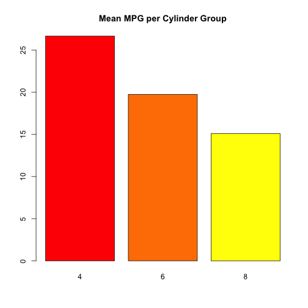

BIOS560R Spring 2014 Week 4 Lab 1:Functions
============================================================
Pittard wsp@emory.edu
***

## Functions

PRACTICE 1.0) VIEWING THE SOURCE CODE OF SOME R FUNCTIONS IS POSSIBLE:

```r

ls
```

```
## function (name, pos = -1L, envir = as.environment(pos), all.names = FALSE, 
##     pattern) 
## {
##     if (!missing(name)) {
##         nameValue <- try(name, silent = TRUE)
##         if (identical(class(nameValue), "try-error")) {
##             name <- substitute(name)
##             if (!is.character(name)) 
##                 name <- deparse(name)
##             warning(gettextf("%s converted to character string", 
##                 sQuote(name)), domain = NA)
##             pos <- name
##         }
##         else pos <- nameValue
##     }
##     all.names <- .Internal(ls(envir, all.names))
##     if (!missing(pattern)) {
##         if ((ll <- length(grep("[", pattern, fixed = TRUE))) && 
##             ll != length(grep("]", pattern, fixed = TRUE))) {
##             if (pattern == "[") {
##                 pattern <- "\\["
##                 warning("replaced regular expression pattern '[' by  '\\\\['")
##             }
##             else if (length(grep("[^\\\\]\\[<-", pattern))) {
##                 pattern <- sub("\\[<-", "\\\\\\[<-", pattern)
##                 warning("replaced '[<-' by '\\\\[<-' in regular expression pattern")
##             }
##         }
##         grep(pattern, all.names, value = TRUE)
##     }
##     else all.names
## }
## <bytecode: 0x1009ab668>
## <environment: namespace:base>
```

***

PRACTICE 1.1) SOME OF THESE FUNCTIONS REFER TO "METHODS". WE HAVE TO WORK A LITTLE HARDER TO SEE THE SOURCE CODE FOR THEM:


```r

t.test
```

```
## function (x, ...) 
## UseMethod("t.test")
## <bytecode: 0x1035a4118>
## <environment: namespace:stats>
```

```r

methods(t.test)
```

```
## [1] t.test.default* t.test.formula*
## 
##    Non-visible functions are asterisked
```

```r

getAnywhere(t.test.default)
```

```
## A single object matching 't.test.default' was found
## It was found in the following places
##   registered S3 method for t.test from namespace stats
##   namespace:stats
## with value
## 
## function (x, y = NULL, alternative = c("two.sided", "less", "greater"), 
##     mu = 0, paired = FALSE, var.equal = FALSE, conf.level = 0.95, 
##     ...) 
## {
##     alternative <- match.arg(alternative)
##     if (!missing(mu) && (length(mu) != 1 || is.na(mu))) 
##         stop("'mu' must be a single number")
##     if (!missing(conf.level) && (length(conf.level) != 1 || !is.finite(conf.level) || 
##         conf.level < 0 || conf.level > 1)) 
##         stop("'conf.level' must be a single number between 0 and 1")
##     if (!is.null(y)) {
##         dname <- paste(deparse(substitute(x)), "and", deparse(substitute(y)))
##         if (paired) 
##             xok <- yok <- complete.cases(x, y)
##         else {
##             yok <- !is.na(y)
##             xok <- !is.na(x)
##         }
##         y <- y[yok]
##     }
##     else {
##         dname <- deparse(substitute(x))
##         if (paired) 
##             stop("'y' is missing for paired test")
##         xok <- !is.na(x)
##         yok <- NULL
##     }
##     x <- x[xok]
##     if (paired) {
##         x <- x - y
##         y <- NULL
##     }
##     nx <- length(x)
##     mx <- mean(x)
##     vx <- var(x)
##     if (is.null(y)) {
##         if (nx < 2) 
##             stop("not enough 'x' observations")
##         df <- nx - 1
##         stderr <- sqrt(vx/nx)
##         if (stderr < 10 * .Machine$double.eps * abs(mx)) 
##             stop("data are essentially constant")
##         tstat <- (mx - mu)/stderr
##         method <- if (paired) 
##             "Paired t-test"
##         else "One Sample t-test"
##         estimate <- setNames(mx, if (paired) 
##             "mean of the differences"
##         else "mean of x")
##     }
##     else {
##         ny <- length(y)
##         if (nx < 1 || (!var.equal && nx < 2)) 
##             stop("not enough 'x' observations")
##         if (ny < 1 || (!var.equal && ny < 2)) 
##             stop("not enough 'y' observations")
##         if (var.equal && nx + ny < 3) 
##             stop("not enough observations")
##         my <- mean(y)
##         vy <- var(y)
##         method <- paste(if (!var.equal) 
##             "Welch", "Two Sample t-test")
##         estimate <- c(mx, my)
##         names(estimate) <- c("mean of x", "mean of y")
##         if (var.equal) {
##             df <- nx + ny - 2
##             v <- 0
##             if (nx > 1) 
##                 v <- v + (nx - 1) * vx
##             if (ny > 1) 
##                 v <- v + (ny - 1) * vy
##             v <- v/df
##             stderr <- sqrt(v * (1/nx + 1/ny))
##         }
##         else {
##             stderrx <- sqrt(vx/nx)
##             stderry <- sqrt(vy/ny)
##             stderr <- sqrt(stderrx^2 + stderry^2)
##             df <- stderr^4/(stderrx^4/(nx - 1) + stderry^4/(ny - 
##                 1))
##         }
##         if (stderr < 10 * .Machine$double.eps * max(abs(mx), 
##             abs(my))) 
##             stop("data are essentially constant")
##         tstat <- (mx - my - mu)/stderr
##     }
##     if (alternative == "less") {
##         pval <- pt(tstat, df)
##         cint <- c(-Inf, tstat + qt(conf.level, df))
##     }
##     else if (alternative == "greater") {
##         pval <- pt(tstat, df, lower.tail = FALSE)
##         cint <- c(tstat - qt(conf.level, df), Inf)
##     }
##     else {
##         pval <- 2 * pt(-abs(tstat), df)
##         alpha <- 1 - conf.level
##         cint <- qt(1 - alpha/2, df)
##         cint <- tstat + c(-cint, cint)
##     }
##     cint <- mu + cint * stderr
##     names(tstat) <- "t"
##     names(df) <- "df"
##     names(mu) <- if (paired || !is.null(y)) 
##         "difference in means"
##     else "mean"
##     attr(cint, "conf.level") <- conf.level
##     rval <- list(statistic = tstat, parameter = df, p.value = pval, 
##         conf.int = cint, estimate = estimate, null.value = mu, 
##         alternative = alternative, method = method, data.name = dname)
##     class(rval) <- "htest"
##     return(rval)
## }
## <bytecode: 0x1035cfbb8>
## <environment: namespace:stats>
```

***

PRACTICE 1.2) THERE ARE SOME FUNCTIONS THAT CAN SHOW US WHAT THE ARGUMENTS ARE FOR A FUNCTION AS WELL AS WHAT AN EXAMPLE MIGHT LOOK LIKE:


```r

args(ls)
```

```
## function (name, pos = -1L, envir = as.environment(pos), all.names = FALSE, 
##     pattern) 
## NULL
```

```r

args(mean)
```

```
## function (x, ...) 
## NULL
```

```r

example(mean)
```

```
## 
## mean> x <- c(0:10, 50)
## 
## mean> xm <- mean(x)
## 
## mean> c(xm, mean(x, trim = 0.10))
## [1] 8.75 5.50
```

***

PRACTICE 1.3) DECLARING A FUNCTION IS EASY:


```r

my.func <- function(somenum) {
    my.return.val = sqrt(somenum)
    return(my.return.val)
}

# We could do it all with one line but that isn't good for readability:

my.func <- function(somenum) {
    return(sqrt(somenum))
}

```

***

PRACTICE 1.4) HERE IS AN EXAMPLE FOR THE pythagorean theorem

```r

pythag <- function(a, b) {
    c = sqrt(a^2 + b^2)
    return(c)
}

pythag(4, 5)
```

```
## [1] 6.403
```

```r

x = 4
y = 5

pythag(x, y)
```

```
## [1] 6.403
```

```r

pythag(a = 4, b = 5)
```

```
## [1] 6.403
```

***

PRACTICE 1.5) WE CAN RETURN A LIST OF INFORMATION

```r
pythag <- function(a, b) {
    c = sqrt(a^2 + b^2)
    myreturnlist = list(hypoteneuse = c, sidea = a, sideb = b)
    return(myreturnlist)
}

pythag(3, 4)

pythag(3, 4)$hypoteneuse

```

***

PRACTICE 2.0) WE NEED TO VERIFY WHAT THE USER IS PASSING TO US IS VALID INPUT. IF WE DON'T THEN WE CAN GET UNEXPECTED RESULTS

```r
pythag <- function(a, b) {
    c = sqrt(a^2 + b^2)
    myreturnlist = list(hypoteneuse = c, sidea = a, sideb = b)
    return(myreturnlist)
}

pythag(3, 4)
```

```
## $hypoteneuse
## [1] 5
## 
## $sidea
## [1] 3
## 
## $sideb
## [1] 4
```

```r

pythag(3, "a")
```

```
## Error: non-numeric argument to binary operator
```

```r

pythag()
```

```
## Error: 'a' is missing
```

```r

pythag(3, )
```

```
## Error: 'b' is missing
```

***

PRACTICE 2.1) WE NEED TO VERIFY WHAT THE USER IS PASSING TO US IS VALID INPUT. IF WE DON'T THEN WE CAN GET UNEXPECTED RESULTS

```r
pythag <- function(a = 4, b = 5) {
    if (!is.numeric(a) | !is.numeric(b)) {
        stop("I need real values to make this work")
    }
    c = sqrt(a^2 + b^2)
    myreturnlist = list(hypoteneuse = c, sidea = a, sideb = b)
    return(myreturnlist)
}

pythag(3, "5")
```

```
## Error: I need real values to make this work
```

```r

pythag("3", 5)
```

```
## Error: I need real values to make this work
```

***

PRACTICE 2.2) WE NEED TO VERIFY WHAT THE USER IS PASSING TO US IS VALID INPUT. IF WE DON'T THEN WE CAN GET UNEXPECTED RESULTS

```r
pythag <- function(a = 4, b = 5) {
    if (!is.numeric(a) | !is.numeric(b)) {
        stop("I need real values to make this work")
    }
    if (a <= 0 | b <= 0) {
        stop("Arguments need to be positive")
    }
    c = sqrt(a^2 + b^2)
    myreturnlist = list(hypoteneuse = c, sidea = a, sideb = b)
    
    return(myreturnlist)
    
}  # End Function

pythag(-3, 3)
```

```
## Error: Arguments need to be positive
```

```r

pythag(3, 3)
```

```
## $hypoteneuse
## [1] 4.243
## 
## $sidea
## [1] 3
## 
## $sideb
## [1] 3
```

***

PRACTICE 3.0) FUNCTIONS NEED TO BE ABLE TO ACCOMMODATE A RANGE OF DATA TYPES. RARELY DO WE DEAL WITH JUST SINGLE VALUES.


```r
is.odd <- function(someval) {
    retvec = vector()
    for (ii in 1:length(someval)) {
        if (someval[ii]%%2 != 0) {
            retvec[ii] = TRUE
        } else {
            retvec[ii] = FALSE
        }
    }
    return(retvec)
    
}  # End function

is.odd(3)
```

```
## [1] TRUE
```

```r

numbers = c(9, 9, 4, 4, 6, 10, 7, 18, 2, 10)

is.odd(numbers)
```

```
##  [1]  TRUE  TRUE FALSE FALSE FALSE FALSE  TRUE FALSE FALSE FALSE
```

```r

numbers[is.odd(numbers)]  # Very useful
```

```
## [1] 9 9 7
```

***

PRACTICE 3.1) LET'S WRITE SOME FUNCTIONS TO PROCESS VECTORS AND AT THE SAME LEARN HOW TO STRUCTURE THE CODE INTERNAL TO FUNCTIONS


```r
# HERE WE HAVE SOME CODE THAT WOULD PROBABLY BE MORE APPROPRIATE FOR A
# FUNCTION

y = vector()
x = seq(-3, 3)
for (ii in 1:length(x)) {
    y[ii] = (x[ii])^2
}

length(x)
```

```
## [1] 7
```

```r

plot(x, y, main = "Super Cool Data Plot", type = "l")
```

 

***

PRACTICE 3.2) LET'S CREATE A FUNCTION TO DO THE ABOVE:

```r

myplotter <- function(xvals, mfunc, plotcolor = "blue") {
    
    # Function to print y = x^2 Input: xvalues Output: A plot and the xvals and
    # yvals used to make that plot
    
    yvals = vector()
    for (ii in 1:length(xvals)) {
        yvals[ii] = mfunc(xvals[ii])
    }
    
    plot(xvals, yvals, main = "Super Cool Data Plot", type = "l", col = plotcolor)
    retlist = list(x = xvals, y = yvals)
    return(retlist)
}

xvals = seq(-3, 3, 0.5)

myplotter(xvals, cos, plotcolor = "red")
```

 

```
## $x
##  [1] -3.0 -2.5 -2.0 -1.5 -1.0 -0.5  0.0  0.5  1.0  1.5  2.0  2.5  3.0
## 
## $y
##  [1] -0.98999 -0.80114 -0.41615  0.07074  0.54030  0.87758  1.00000
##  [8]  0.87758  0.54030  0.07074 -0.41615 -0.80114 -0.98999
```

***

PRACTICE 3.3) WE'LL NOW CREATE A FUNCTION THAT FINDS THE MINIMUM OF A VECTOR:

```r
mymin <- function(somevector) {
    
    # Function to find the minimum value in a vector Input: A numeric vector
    # Output: A single value that represents the minimum
    
    mymin = somevector[1]  # Set the minimum to an arbitrary value
    
    # Now loop through the entire vector. If we find a value less than mymin
    # then we set mymin to be that value.
    
    for (ii in 1:length(somevector)) {
        if (somevector[ii] < mymin) {
            mymin = somevector[ii]
        }
    }
    return(mymin)
}

set.seed(123)

testvec = rnorm(10000)

mymin(testvec)
```

```
## [1] -3.845
```

```r

min(testvec)  # Matches the built in R function
```

```
## [1] -3.845
```

***

PRACTICE 3.4) WE'LL NOW EXTEND THIS TO ACCOMMODATE OPTIONS FOR FINDING A MAX OR MIN

```r
myextreme <- function(somevector, action = "min") {
    
    if (action == "min") {
        myval = somevector[1]  # Set the minimum to an arbitrary value
        
        for (ii in 1:length(somevector)) {
            if (somevector[ii] < myval) {
                myval = somevector[ii]
            }
        }  # End for
        
    } else {
        # If action is not 'min' then we assume the 'max' is wanted
        
        myval = somevector[1]  # Set the minimum to an arbitrary value
        
        for (ii in 1:length(somevector)) {
            if (somevector[ii] > myval) {
                myval = somevector[ii]
            }
        }  # End for
    }  # End If  
    return(myval)
}

myextreme(testvec, "min")
```

```
## [1] -3.845
```

```r

myextreme(testvec, "max")
```

```
## [1] 3.848
```

```r

min(testvec)
```

```
## [1] -3.845
```

```r

max(testvec)
```

```
## [1] 3.848
```

***


PRACTICE 4.0) WE CAN WRITE FUNCTIONS THAT HELP US PROCESS "SPLIT" DATAFRAMES:

```r
myfunc <- function(somedf, somefac) {
    
    # Function to split a data frame by a given factor Input: A data frame, a
    # factor Output: A list containing a count of records in each group
    
    retlist = list()  # Empty list to return group record count 
    mysplits = split(somedf, somefac)  # Split the data frame by somefac
    
    for (ii in 1:length(mysplits)) {
        # loop through the splits
        retlist[[ii]] = nrow(mysplits[[ii]])
    }
    names(retlist) = names(mysplits)
    return(retlist)
}

myfunc(mtcars, mtcars$cyl)
```

```
## $`4`
## [1] 11
## 
## $`6`
## [1] 7
## 
## $`8`
## [1] 14
```

***


PRACTTICE 4.1) WE CAN WRITE FUNCTIONS THAT HELP US PROCESS MATRICES:

```r
mtcenter <- function(somemat) {
    
    # Input: A matrix to center Output: A matrix that is centered
    
    retmat = rep(0, length(somemat))  # Recipe to initialize a 
    dim(retmat) = dim(somemat)  # matrix the same size as
    # another filled with 0
    
    for (col in 1:ncol(somemat)) {
        for (row in 1:nrow(somemat)) {
            retmat[row, col] = somemat[row, col] - mean(somemat[, col])
        }
    }
    
    return(retmat)
}

set.seed(123)

mymat = matrix(round(rnorm(6), 2), 3, 2)

mtcenter(mymat)
```

```
##         [,1]  [,2]
## [1,] -0.8167 -0.57
## [2,] -0.4867 -0.51
## [3,]  1.3033  1.08
```

***

PRACTICE 4.2) IN R WE USE LOTS OF ANONYMOUS FUNCTIONS TO DO WORK ALTHOUGH THEY AREN'T ALWAYS EASY TO UNDERSTAND:

```r
my.mat = as.matrix(mtcars[, c(1, 3:6)])

head(my.mat)
```

```
##                    mpg disp  hp drat    wt
## Mazda RX4         21.0  160 110 3.90 2.620
## Mazda RX4 Wag     21.0  160 110 3.90 2.875
## Datsun 710        22.8  108  93 3.85 2.320
## Hornet 4 Drive    21.4  258 110 3.08 3.215
## Hornet Sportabout 18.7  360 175 3.15 3.440
## Valiant           18.1  225 105 2.76 3.460
```

```r

apply(my.mat, 2, mean)
```

```
##     mpg    disp      hp    drat      wt 
##  20.091 230.722 146.688   3.597   3.217
```

```r

my.mat = as.matrix(mtcars[, c(1, 3:6)])

head(my.mat)
```

```
##                    mpg disp  hp drat    wt
## Mazda RX4         21.0  160 110 3.90 2.620
## Mazda RX4 Wag     21.0  160 110 3.90 2.875
## Datsun 710        22.8  108  93 3.85 2.320
## Hornet 4 Drive    21.4  258 110 3.08 3.215
## Hornet Sportabout 18.7  360 175 3.15 3.440
## Valiant           18.1  225 105 2.76 3.460
```

```r

apply(my.mat, 2, function(x) {
    c(mean = mean(x), sd = sd(x), range = range(x))
})
```

```
##           mpg  disp     hp   drat     wt
## mean   20.091 230.7 146.69 3.5966 3.2172
## sd      6.027 123.9  68.56 0.5347 0.9785
## range1 10.400  71.1  52.00 2.7600 1.5130
## range2 33.900 472.0 335.00 4.9300 5.4240
```

```r

apply(my.mat, 2, function(x) {
    c(mean = mean(x), sd = sd(x), range = range(x))
})
```

```
##           mpg  disp     hp   drat     wt
## mean   20.091 230.7 146.69 3.5966 3.2172
## sd      6.027 123.9  68.56 0.5347 0.9785
## range1 10.400  71.1  52.00 2.7600 1.5130
## range2 33.900 472.0 335.00 4.9300 5.4240
```

***

PRACTICE 4.3) WE CAN WRITE A FUNCTION TO DETERMINE THE SQUARE ROOT OF A NUMBER USING NEWTON'S FORMULA:

```r
mynewton <- function(n, guess, toler = 1e-04) {
    
    # Function to compute square root of a number n INPUT: 'n' a positive number
    # 'guess' our initial guess 'toler' a tolerance threshold
    
    # OUTPUT: a vector containing our computed answer and the number of
    # iterations necessary to achieve it
    
    retvec = vector()  # Vector to return our answer 
    numofiters = 0  # We keep track of how many iterations we do
    diff = n - (guess^2)  # Compute how close our initial guess came
    
    while (abs(diff) >= toler) {
        guess = (n/guess + guess)/2
        diff = n - (guess^2)
        numofiters = numofiters + 1
    }
    return(c(lastguess = guess, iterations = numofiters))
}

mynewton(121, 9)
```

```
##  lastguess iterations 
##         11          3
```

***

PRACTICE 4.0) WE CAN WRITE FUNCTIONS THAT HELP US PROCESS "SPLIT" DATAFRAMES:

```r
myfunc <- function(somedf, somefac) {
    
    # Function to split a data frame by a given factor Input: A data frame, a
    # factor Output: A list containing a count of records in each group
    
    retlist = list()  # Empty list to return group record count 
    mysplits = split(somedf, somefac)  # Split the data frame by somefac
    
    for (ii in 1:length(mysplits)) {
        # loop through the splits
        retlist[[ii]] = nrow(mysplits[[ii]])
    }
    names(retlist) = names(mysplits)
    return(retlist)
}

myfunc(mtcars, mtcars$cyl)
```

```
## $`4`
## [1] 11
## 
## $`6`
## [1] 7
## 
## $`8`
## [1] 14
```

***


PRACTTICE 4.1) WE CAN WRITE FUNCTIONS THAT HELP US PROCESS MATRICES:

```r
mtcenter <- function(somemat) {
    
    # Input: A matrix to center Output: A matrix that is centered
    
    retmat = rep(0, length(somemat))  # Recipe to initialize a 
    dim(retmat) = dim(somemat)  # matrix the same size as
    # another filled with 0
    
    for (col in 1:ncol(somemat)) {
        for (row in 1:nrow(somemat)) {
            retmat[row, col] = somemat[row, col] - mean(somemat[, col])
        }
    }
    
    return(retmat)
}

set.seed(123)

mymat = matrix(round(rnorm(6), 2), 3, 2)

mtcenter(mymat)
```

```
##         [,1]  [,2]
## [1,] -0.8167 -0.57
## [2,] -0.4867 -0.51
## [3,]  1.3033  1.08
```

***

PRACTICE 4.2) IN R WE USE LOTS OF ANONYMOUS FUNCTIONS TO DO WORK ALTHOUGH THEY AREN'T ALWAYS EASY TO UNDERSTAND:

```r
my.mat = as.matrix(mtcars[, c(1, 3:6)])

head(my.mat)
```

```
##                    mpg disp  hp drat    wt
## Mazda RX4         21.0  160 110 3.90 2.620
## Mazda RX4 Wag     21.0  160 110 3.90 2.875
## Datsun 710        22.8  108  93 3.85 2.320
## Hornet 4 Drive    21.4  258 110 3.08 3.215
## Hornet Sportabout 18.7  360 175 3.15 3.440
## Valiant           18.1  225 105 2.76 3.460
```

```r

apply(my.mat, 2, mean)
```

```
##     mpg    disp      hp    drat      wt 
##  20.091 230.722 146.688   3.597   3.217
```

```r

my.mat = as.matrix(mtcars[, c(1, 3:6)])

head(my.mat)
```

```
##                    mpg disp  hp drat    wt
## Mazda RX4         21.0  160 110 3.90 2.620
## Mazda RX4 Wag     21.0  160 110 3.90 2.875
## Datsun 710        22.8  108  93 3.85 2.320
## Hornet 4 Drive    21.4  258 110 3.08 3.215
## Hornet Sportabout 18.7  360 175 3.15 3.440
## Valiant           18.1  225 105 2.76 3.460
```

```r

apply(my.mat, 2, function(x) {
    c(mean = mean(x), sd = sd(x), range = range(x))
})
```

```
##           mpg  disp     hp   drat     wt
## mean   20.091 230.7 146.69 3.5966 3.2172
## sd      6.027 123.9  68.56 0.5347 0.9785
## range1 10.400  71.1  52.00 2.7600 1.5130
## range2 33.900 472.0 335.00 4.9300 5.4240
```

```r

apply(my.mat, 2, function(x) {
    c(mean = mean(x), sd = sd(x), range = range(x))
})
```

```
##           mpg  disp     hp   drat     wt
## mean   20.091 230.7 146.69 3.5966 3.2172
## sd      6.027 123.9  68.56 0.5347 0.9785
## range1 10.400  71.1  52.00 2.7600 1.5130
## range2 33.900 472.0 335.00 4.9300 5.4240
```

***

PRACTICE 4.4) WE CAN REFACTOR THE FUNCTION AND BREAK IT UP INTO COMPOMENTS:

```r
improve <- function(guess, n) {
    return((n/guess + guess)/2)
}

good_enough <- function(n, guess) {
    diff = abs(n - guess^2)
    return(diff < 0.001)
}

square_root <- function(n, guess) {
    while (!good_enough(n, guess)) {
        guess = improve(guess, n)
    }
    return(guess)
}

my_sqrt <- function(n, guess) {
    r = square_root(n, guess)
    return(r)
}

my_sqrt(121, 9)
```

```
## [1] 11
```

***
