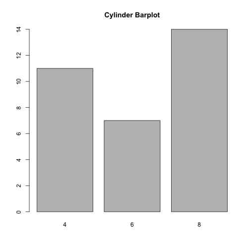

BIOS560R Spring 2014 Week 4 Lab 2: Functions and Debugging
============================================================
Pittard wsp@emory.edu
***

## FUNCTIONS AND SCOPE

PRACTICE 1.0) NOTE THAT YOUR DEFAULT R SESSIONS RUNS IN A GLOBAL ENVIRONMENT

```r

environment()
```

```
## <environment: R_GlobalEnv>
```

```r

ls()  # What is in your current environment ? Anything interesting ?
```

```
## character(0)
```

```r

# Don't do the following unless you want to remove all objects in the
# current environment

rm(list = ls())
```

***

PRACTICE 1.1) FUNCTIONS ALSO RUN WITHIN THEIR OWN ENVIROMENT 

```r

environment()
```

```
## <environment: R_GlobalEnv>
```

```r

# Functions run within their own 'frame' and evironment

myenvfunc <- function() {
    print(environment())
}

myenvfunc()
```

```
## <environment: 0x10353cdf0>
```

***

PRACTICE 1.2) VARIABLES WITHIN A FUNCTION WILL "MASK" VARIABLES OF THE SAME NAME IN THE GLOBAL ENVIRONMENT


```r

x = 0  # Set x to zero in the global environment (your console)

myfunc <- function(x) {
    # Define this function
    x = 3  # This value of 'x' is private
    return(x)
}

myfunc()  # Function returns 3
```

```
## [1] 3
```

```r

x  # The value of x does not get overwritten
```

```
## [1] 0
```

***

PRACTICE 1.3) LET'S LOOK AT VARIABLE SCOPE


```r
exampf <- function(x) {
    return(x + a)
}

a = 10
x = 5

ls()
```

```
## [1] "a"         "exampf"    "myenvfunc" "myfunc"    "x"
```

```r

exampf(2)
```

```
## [1] 12
```

***

PRACTICE 1.4) LET'S LOOK AT VARIABLE SCOPE WHEN WE HAVE TWO FUNCTIONS DEFINED WITHIN THE GLOBAL ENVIRONMENT. 
THEY ARE "PEER" FUNCTIONS.


```r
a = 10

x = 5

f <- function(x) {
    a = 5
    g(x)
}

g <- function(y) {
    return(y + a)
}

f(2)
```

```
## [1] 12
```

***

PRACTICE 1.5) NEXT WE LOOK AT A SCOPE FOR A FUNCTION THAT IS DEFINED WITHIN ANOTHER FUNCTION


```r
a = 10

x = 5

f <- function(x) {
    a = 5
    g <- function(y) {
        return(y + a)
    }
    g(x)
}

f(2)
```

```
## [1] 7
```

***

PRACTICE 2.0) DON'T DEFINE A FUNCTION WITHIN ANOTHER FUNCTION IF YOU WANT THAT FUNCTION TO BE GENERALLY AVAILABLE.


```r

# This function is available within the global environment.

is.odd <- function(somenumber) {
    retval = 0
    if (somenumber%%2 != 0) {
        retval = TRUE
    } else {
        retval = FALSE
    }
    return(retval)
}
is.odd(3)
```

```
## [1] TRUE
```

```r

# However, if you define is.odd within another function, mymedian, it will
# not be available except within the scope of mymedian

mymedian <- function(medianvec) {
    
    is.odd <- function(somenumber) {
        # We define is.odd inside of mymedian
        retval = 0
        if (somenumber%%2 != 0) {
            retval = TRUE
        } else {
            retval = FALSE
        }
        return(retval)
    }
    
    # Function to compute the median of a vector
    
    medianveclength = length(medianvec)
    if (is.odd(medianveclength)) {
        
        # We find the median using the formula for odd length vectors
        
    } else {
        
        # We find the median using the formula for even length vectors
        
    }
}
```

***

PRACTICE 2.1) THE ORDER IN WHICH WE SUPPLY THE ARGUMENTS DOES MATTER. THIS IS CALLED POSITIONAL MATCHING.


```r

pythag <- function(a = 4, b = 5) {
    if (!is.numeric(a) | !is.numeric(b)) {
        stop("I need real values to make this work")
    }
    hypo = sqrt(a^2 + b^2)
    myreturnlist = list(hypoteneuse = hypo, sidea = a, sideb = b)
    return(myreturnlist)
}

# IF WE CALL THE FUNCTION LIKE THIS:

pythag(4, 5)  # 4 is assigned to a and 5 is assigned to b
```

```
## $hypoteneuse
## [1] 6.403
## 
## $sidea
## [1] 4
## 
## $sideb
## [1] 5
```

```r

pythag(5, 4)  # 5 is assigned to a and 4 is assigned to b
```

```
## $hypoteneuse
## [1] 6.403
## 
## $sidea
## [1] 5
## 
## $sideb
## [1] 4
```

```r

```

***

PRACTICE 2.2) THE MEAN FUNCTION CAN ACCOMMODATE A NUMBER OF ARGUMENTS.


```r

set.seed(1)

myx = rnorm(20)

mean(myx)  # myx MATCHES the 'x' argument
```

```
## [1] 0.1905
```

```r

mean(myx, 0.05)  # myx MATCHES 'x' and 0.05 MATCHES 'trim'
```

```
## [1] 0.2461
```

```r

mean(myx, 0.05, TRUE)  # myx MATCHES 'x', 0.05 MATCHES 'trim', TRUE matches na.rm
```

```
## [1] 0.2461
```

```r

# COULD DO:

mean(x = myx, trim = 0.05, na.rm = TRUE)
```

```
## [1] 0.2461
```

```r

# As long as you name the arguments you type them in any order

mean(trim = 0.05, na.rm = TRUE, x = myx)
```

```
## [1] 0.2461
```

***

PRACTICE 2.3) IF YOU DON'T SPECIFY ARGUEMENT NAMES YOU MUST ADHERE TO THE EXPECTED ORDER:


```r
# BUT THIS WON'T WORK:

# Can't switch positions without using the names

mean(TRUE, 0.05, myx)
```

```
## Warning: the condition has length > 1 and only the first element will be
## used
```

```
## [1] 1
```

***

PRACTICE 3.0) THE ... ARGUEMNT LET'S US PASS IN ADDITIONAL UNDEFINED ARGUEMENTS TO A FUNCTION - AS LONG AS THEY MAKE SENSE. THE PLOT FUNCTION ACCOMMODATES A 
VERY LARGE NUMBER ARGUEMENTS.


```r
plot(x = mtcars$wt, y = mtcars$mpg)
```

 

```r

plot(x = mtcars$wt, y = mtcars$mpg, bty = "l")
```

 

```r

plot(x = mtcars$wt, y = mtcars$mpg, main = "Default")
```

 

```r

plot(x = mtcars$wt, y = mtcars$mpg, tck = 0.05, main = "tck=0.05")
```

 

```r

plot(x = mtcars$wt, y = mtcars$mpg, axes = F, main = "Different tick marks for each axis")
```

 

```r

plot(x = mtcars$wt, y = mtcars$mpg, xlim = c(0, 100), xlab = "Gallons", pch = 21, 
    bg = "blue", col = "red")
```

 

***

PRACTICE 3.1) THE ... ARGUEMNT LET'S US PASS IN ADDITIONAL UNDEFINED ARGUEMENTS TO A FUNCTION - AS LONG AS THEY MAKE SENSE. THE PLOT FUNCTION ACCOMMODATES A 
VERY LARGE NUMBER ARGUEMENTS.


```r
plot(x = mtcars$wt, y = mtcars$mpg)
```

 

```r

plot(x = mtcars$wt, y = mtcars$mpg, bty = "l")
```

 

```r

plot(x = mtcars$wt, y = mtcars$mpg, main = "Default")
```

 

```r

plot(x = mtcars$wt, y = mtcars$mpg, tck = 0.05, main = "tck=0.05")
```

 

```r

plot(x = mtcars$wt, y = mtcars$mpg, axes = F, main = "Different tick marks for each axis")
```

 

```r

plot(x = mtcars$wt, y = mtcars$mpg, xlim = c(0, 100), xlab = "Gallons", pch = 21, 
    bg = "blue", col = "red")
```

 

***

PRACTICE 3.2) USING THE ... ARGUMENT WE CAN "THROW" ARGUMENTS AT THE PLOT FUNCTION.


```r

my.plot <- function(x, y, ...) {
    plot(x, y, col = "red", ...)
}

my.plot(x = mtcars$wt, y = mtcars$mpg, pch = 15, lty = 2, xlim = c(0, 40))
```

 

```r

my.plot <- function(...) {
    plot(...)
}

my.plot(x = mtcars$wt, y = mtcars$mpg, pch = 15, lty = 2, xlim = c(0, 40))
```

 

***

PRACTICE 4.0) DEBUGGING FUNCTIONS IS AN IMPORTANT SKILL. USUALLY WE INSERT PRINT OR CAT STATEMENTS. BUT THIS IS A LIMITED APPROACH.


```r

my.func = function(x, y) {
    if (!is.numeric(x) || !is.numeric(y)) {
        warning("Check your input")
    }
    cat("x is", x, "y is", y, "\n")
    z = x + y
    return(z)
}

my.func(1, "2")
```

```
## Warning: Check your input
```

```
## x is 1 y is 2
```

```
## Error: non-numeric argument to binary operator
```

***

PRACTICE 4.1) USING TRACEBACK WILL SHOW US THE "STACK" (ORDER) OF FUNCTION CALLS AS WELL AS RELEVANT LINE NUMBERS.


```r
foo <- function(x) {
    print(1)
    bar(2)
}

bar <- function(x) {
    x + some.nonexistent.variable
}

foo(2)  # This will generate an error

traceback()  # SHOWS US THE PROBLEM
```

***

PRACTICE 4.2) THIS EXAMPLE IS MORE INVOLVED. FIRST WE WILL SHOW A CASE WHERE THE
FUNCTIONS DO NOT GENERATE AN ERROR.


```r
f = function(x) {
    r = x - g(x)
    return(r)
}

g = function(y) {
    r = y * h(y)
    return(r)
}

h = function(x) {
    r = log(x)
    if (r < 10) 
        return(r^2) else return(r^3)
}

f(2)
```

```
## [1] 1.039
```

***

PRACTICE 4.3) HERE WE GENERATE AN ERROR INTENTIONALLY.


```r
f = function(x) {
    r = x - g(x)
    return(r)
}

g = function(y) {
    r = y * h(y)
    return(r)
}

h = function(x) {
    r = log(x)
    if (r < 10) 
        return(r^2) else return(r^3)
}

f(-1)
```

```
## Warning: NaNs produced
```

```
## Error: missing value where TRUE/FALSE needed
```

```r

traceback()  # This will show us the sequence of calls that led to the error.
```

```
## No traceback available
```

***

PRACTICE 4.4) BUT WE CAN USE THE DEBUG FUNCTION ALSO. LET'S START USING A BASIC EXAMPLE:


```r
SS <- function(mu, x) {    # Compute Sum of Squares
  d = x - mu
	d2 = d^2
	ss = sum(d2)
	return(ss)
}

# Set the seed so that the results are reproducible


set.seed(100)

x = rnorm(100)

SS(1,x)

debug(SS)

SS  # Starts a debug session
i
Browse[2]> d[1]
[1] -1.502192

Browse[2]> n
debug at #4: ss <- sum(d2)

Browse[2]> ls()
[1] "d"  "d2" "mu" "x"

Browse[2]> hist(d2)  # Can do this on the fly

Browse[2]> n
debug at #5: ss

Browse[2]> ls()
[1] "d"  "d2" "mu" "ss" "x"

Browse[2]> length(ss)
[1] 1

Browse[2]> ss

Browse[2]> yy = x ^2   # Create a New Object

Browse[2]> yy[1]
[1] 0.2521972

Browse[2]> where                # Where are we ? Oh yea in SS
where 1: SS(1, x)

Browse[2]> c                            # Continue without stopping

exiting from: SS(1, x)
[1] 202.5615

undebug(SS)           # Turns off debugging

```

***


PRACTICE 4.5) LET's LOOK AT AN EXAMPLE WITH NESTED FUNCTION CALLING:


```r

f = function(x) {
  r = x - g(x)
  r
}

g = function(y) {
  r = y * h(y)
  r
}

h = function(x) {
  r = log(x)
  if(r < 10)
     r^2
  else
     r^3
}

debug(f)

debug(g)

debug(h)

f(-1)
debugging in: f(-1)
debug at #1: {
    r = x - g(x)
    r
}

Browse[2]> where   # Tells us where we are
where 1: f(-1)

Browse[2]> n
debug at #2: r = x - g(x)

Browse[2]> n            # Note we are "stepping into g"
debugging in: g(x)
debug at #1: {
    r = y * h(y)
    r
}

Browse[3]> n
debug at #2: r = y * h(y)

Browse[3]> n            # Note we are "stepping into h"
debugging in: h(y)
debug at #1: {
    r = log(x)
    if (r < 10)
        r^2
    else r^3
}

Browse[4]> n
debug at #2: r = log(x)

Browse[4]> n
debug at #3: if (r < 10) r^2 else r^3

Browse[4]> n

Error in if (r < 10) r^2 else r^3 : missing value where TRUE/FALSE needed
In addition: Warning message:
In log(x) : NaNs produced

```

***


