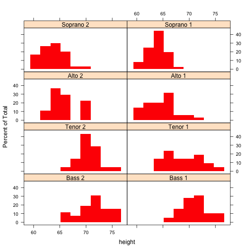
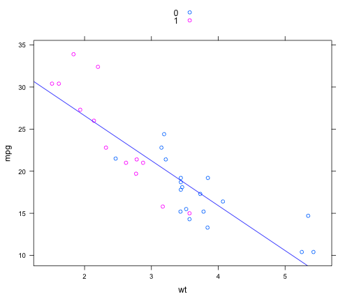

Title
========================================================

This is an R Markdown document. Markdown is a simple formatting syntax for authoring web pages (click the **Help** toolbar button for more details on using R Markdown).

When you click the **Knit HTML** button a web page will be generated that includes both content as well as the output of any embedded R code chunks within the document. You can embed an R code chunk like this:


```r
library(lattice)
```

```
## Warning: package 'lattice' was built under R version 3.0.2
```

```r
histogram(~height | voice.part, data = singer, layout = c(2, 4), border = "transparent", 
    col = "red")
```

 


You can also embed plots, for example:


```r
mypanel <- function(x, y, groups = groups, ...) {
    panel.xyplot(x, y, groups = groups, ...)
    panel.lmline(x, y, col = "blue")
    auto.key = T
}

xyplot(mpg ~ wt, data = mtcars, groups = factor(am), panel = mypanel, auto.key = T)
```

 


