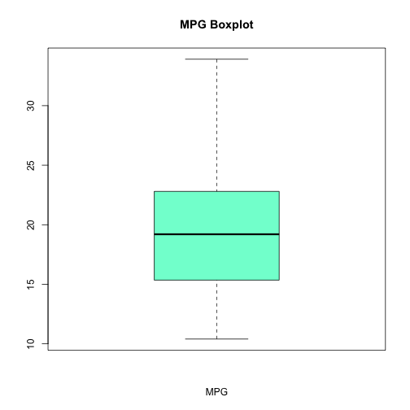
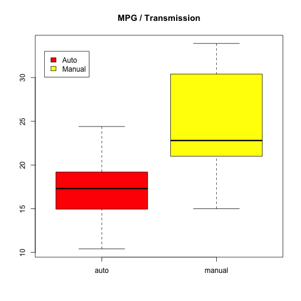
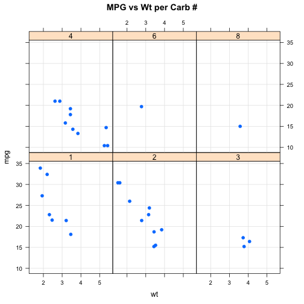
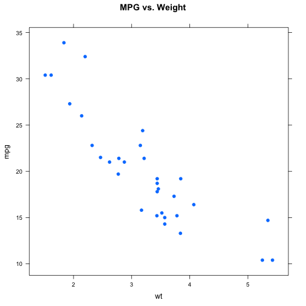
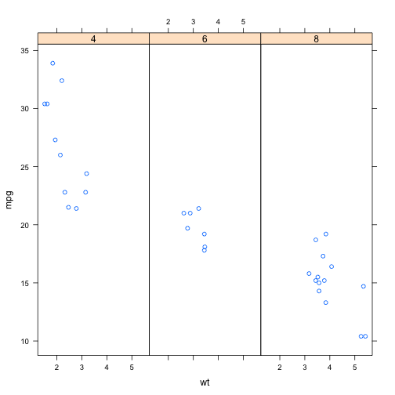
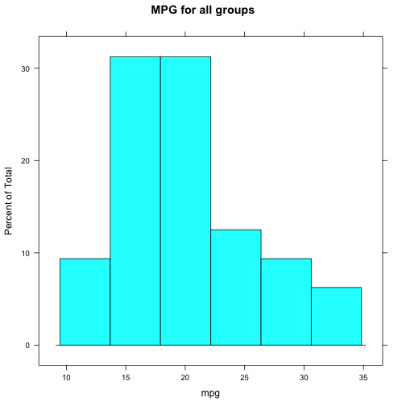
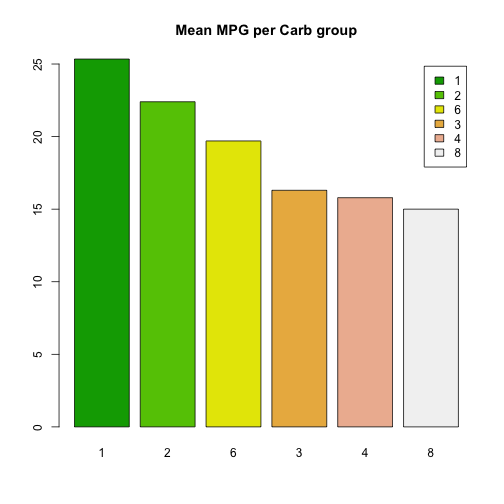

BIOS560R Spring 2014 Week 5 Lab 1: Graphics Part 1
============================================================
Pittard wsp@emory.edu
***

## Base Graphics

PRACTICE 1.0) DRAWING GRAPHICS USING GRAPHICS "PRIMITIVES" IS EASY.


```r
plot(0:10, 0:10, type = "n", xlab = "X", ylab = "Y", axes = FALSE)

abline(h = seq(0, 10, 2), lty = 3, col = "gray90")

abline(v = seq(0, 10, 2), lty = 3, col = "gray90")

text(5, 5, "Plot Stuff Here", col = "red", cex = 1.5)

box("plot", col = "red", lty = "dotted")

box("inner", col = "blue", lty = "dashed")

mtext("South Margin", 1, cex = 1.2, col = "blue")

mtext("West Margin", 2, cex = 1.2, col = "green")

mtext("North Margin", 3, cex = 1.2, col = "orange")

mtext("East Margin", 4, cex = 1.2, col = "purple")

title("An Example Plot")
```

 

***

PRACTICE 1.1) WE CAN CREATE PLOTS SIDE-BY-SIDE (TWO PANELS ON A SINGLE PLOT WINDOW) 

```r


plot(mtcars$wt, mtcars$mpg, main = "MPG vs. Weight")
```

 

```r

plot(mtcars$mpg, main = "MPG", type = "l", xlab = "Car Number", ylab = "MPG")
```

 

```r

plot(mtcars$mpg, main = "MPG", type = "b", xlab = "Car Number", ylab = "MPG")
```

 

```r


par(mfrow = c(1, 2))  # One row and two columns

plot(mtcars$mpg, main = "MPG", type = "l", xlab = "Car Number", ylab = "MPG")

plot(mtcars$mpg, main = "MPG", type = "b", xlab = "Car Number", ylab = "MPG")
```

 

```r


par(mfrow = c(2, 2))

plot(mtcars$mpg, main = "MPG", xlab = "Car", ylab = "MPG", type = "p")

plot(mtcars$mpg, main = "MPG", xlab = "Car", ylab = "MPG", type = "l")

plot(mtcars$mpg, main = "MPG", xlab = "Car", ylab = "MPG", type = "h")

plot(mtcars$mpg, main = "MPG", xlab = "Car", ylab = "MPG", type = "o")

legend("topleft", legend = c("Test Legend"), cex = 0.8)

```

 

***

PRACTICE 1.2) WE CAN GENERATE A PLOT USING FOR LOOPS 


```r

unique(mtcars$cyl)  # We have three categories so let's create 3 plots
```

```
## [1] 6 4 8
```

```r

par(mfrow = c(1, 3))  # One row and three columns

fourcyl = mtcars[mtcars$cyl == 4, ]
sixcyl = mtcars[mtcars$cyl == 6, ]
eightcyl = mtcars[mtcars$cyl == 8, ]

plot(fourcyl$wt, fourcyl$mpg, main = "MPG vs Wt 4 Cyl", ylim = c(0, 40))
plot(sixcyl$wt, sixcyl$mpg, main = "MPG vs Wt 6 Cyl", ylim = c(0, 40))
plot(eightcyl$wt, eightcyl$mpg, main = "MPG vs Wt 8 Cyl", ylim = c(0, 40))
```

 

```r

par(mfrow = c(1, 1))  # Reset the plot window

# Slide 28

par(mfrow = c(1, 3))  # One row and three columns
mysplits = split(mtcars, mtcars$cyl)

for (ii in 1:length(mysplits)) {
    plot(mysplits[[ii]]$wt, mysplits[[ii]]$mpg, ylim = c(0, 40), main = paste("MPG vs weight for", 
        names(mysplits[ii])))
}
```

 

```r

# Better yet we could make this into a function

cyl.plot <- function(df, fac, numrows = 1, numcols = 3) {
    par(mfrow = c(numrows, numcols))
    mysplits = split(df, fac)
    for (ii in 1:length(mysplits)) {
        plot(mysplits[[ii]]$wt, mysplits[[ii]]$mpg, ylim = c(0, 40), main = paste("MPG vs weight for", 
            names(mysplits[ii])))
    }
}
cyl.plot(mtcars, mtcars$cyl)

par(mfrow = c(1, 1))  # reset the plot device
```

***


PRACTICE 1.3) MORE PLOTTING EXAMPLES WITH ANNOTATION


```r

plot(mtcars$wt, mtcars$mpg, xlab = "Weight / 1,000", ylab = "MPG", xlim = c(0, 
    10), ylim = c(0, 40))

# Slide 30

plot(mtcars$wt, mtcars$mpg, xlab = "Weight / 1,000", ylab = "MPG", xlim = c(0, 
    10), ylim = c(0, 40))


legend("topright", inset = 0.05, "My Data", pch = 1, col = "black")

# Could use specific coordinates also

legend(6.5, 35, inset = 0.05, "My Data", pch = 1, col = "black")
```

 

```r

# Slide 32

plot(mtcars$wt, mtcars$mpg, xlab = "Weight / 1,000", main = "MPG vs. WT")

abline(v = c(2, 3, 4, 5), lty = 2, col = "gray90")

# Draws vertical dashed lines at 2,3,4,5

abline(h = c(10, 15, 20, 25, 30), lty = 2, col = "gray90")

# Horizontal lines at 10,15,20,25,30

# Could do:

abline(v = c(2, 3, 4, 5), lty = 2, col = "gray90")

abline(h = seq(10, 30, 5), lty = 2, col = "gray90")
```

 

```r

# Slide 34

plot(mtcars$wt, mtcars$mpg, main = "MPG vs WT", col = "red", xlab = "Weight in lbs/1,000", 
    ylab = "Miles per Gallon", pch = 3)


legend("topright", inset = 0.05, "My Data", pch = 3, col = "red")

grid(col = "blue")
```

 

***

## Plot Characters

2.0) LET'S PLOT POINTS (MPG VS WT) AND USE DIFFERENT PLOT CHARACTERS BASED ON TRANSMISSION TYPE


```r
# example(pch) THIS GENERATES A LOT OF OUTPUT

# Slide 36

plot(mtcars$wt, mtcars$mpg, type = "n", main = "MPG vs. Weight")  # A null plot

auto = mtcars[mtcars$am == 0, ]
manu = mtcars[mtcars$am == 1, ]

points(auto$wt, auto$mpg, pch = 0)
points(manu$wt, manu$mpg, pch = 1)

legend("topright", inset = 0.05, c("manual", "auto"), pch = c(1, 0))
```

 

```r

# Slide 38

plot(mtcars$wt, mtcars$mpg, pch = mtcars$am, main = "MPG vs. Weight", sub = "Different plot chars")

legend("topright", inset = 0.05, c("manual", "auto"), pch = unique(mtcars$am))
```

 

***

## PLOT COLORS

2.1) HERE WE USE DIFFERENT COLORS TO INDICATE POINTS ABOVE AND BELOW THE MEAN WEIGHT


```r
plot(mtcars$wt, mtcars$mpg, type = "n", xlab = "Weight in lbs/1,000", ylab = "MPG", 
    main = "MPG vs. Weight")

# Let's get records for each category

above.mean = mtcars[mtcars$wt >= mean(mtcars$wt), ]

below.mean = mtcars[mtcars$wt < mean(mtcars$wt), ]

# Use the points command to plot each group

points(below.mean$wt, below.mean$mpg, col = "red")

points(above.mean$wt, above.mean$mpg, col = "blue")

# Draw a vertical line where the mean(wt) is

abline(v = mean(mtcars$wt), lty = 2, col = "gray90")
```

 

***


2.2) OR WE CAN USE THE IFELSE STRUCTURE TO MAKE THIS HAPPEN MORE CONVENIENTLY. ALWAYS LOOK FOR SHORTCUTS


```r
colvec = ifelse(mtcars$wt >= mean(mtcars$wt), "blue", "red")

plot(mtcars$wt, mtcars$mpg, col = colvec)

# OR YOU COULD DO IT ALL IN ONE LINE THOUGH READABILITY SUFFERS

plot(mtcars$wt, mtcars$mpg, col = ifelse(mtcars$wt >= mean(mtcars$wt), "blue", 
    "red"))
```

 

***

3.0) WE CAN DO MORE ANNOTATION


```r
plot(mtcars$wt, mtcars$mpg, main="Mileage vs. Car Weight",
               xlab="Weight", 
               ylab="Mileage", 
               pch=18, col="blue")


text(mtcars$wt, mtcars$mpg, # Note we cannot use the formula in text
      row.names(mtcars),    # Get the row names
      cex=0.6,              # Scaling of the font size
      pos=4,                # 1=below, 2=left, 3=above, 4=right 
      col="red")
```

 

***

3.0) HERE WE PUT UP LABELS NEXT TO THE POINTS AND PLACE INFORMATION IN THE MARGINS


```r
plot(mtcars$wt, mtcars$mpg, main="Mileage vs. Car Weight",
               xlab="Weight", 
               ylab="Mileage", 
               pch=18, col="blue")


text(mtcars$wt, mtcars$mpg, # Note we cannot use the formula in text
      row.names(mtcars),    # Get the row names
      cex=0.6,              # Scaling of the font size
      pos=4,                # 1=below, 2=left, 3=above, 4=right 
      col="red")

mtext("This is the bottom margin",1)

mtext("This is the left side margin",2)

mtext("This is the top margin",3)

mtext("This is the right side margin",4)
```

 

***


3.0) THIS IS A MORE INVOLVED EXAMPLE THOUGH IS A GOOD ONE TO STUDY AS IT IS REPRESENTATIVE OF "REAL WORLD" GRAPHS


```r
plot(mtcars$mpg ~ mtcars$wt,cex=0.8,
    pch=21,col="blue",bg="red",
    xlab="Wt in Lbs/1,000",
    ylab="Miles Per Gallon")

title(main="The mtcars data set wt vs. MPG")

# Next draw a vertical line at the mean of the weight

abline(v=mean(mtcars$wt),lty=2,col="blue")

# Next draw a horizontal line at the man of the MPG

abline(h=mean(mtcars$mpg),lty=2,col="blue")

points(mean(mtcars$wt),       # Draws a diamond at the common mean
       mean(mtcars$mpg),
       pch=23,col="black",
       bg="brown",
       cex=2)


text(mean(mtcars$wt),min(mtcars$mpg),
     paste("Mean:",round(mean(mtcars$wt),2)),pos=4)

text(min(mtcars$wt),mean(mtcars$mpg),
    paste("Mean:",round(mean(mtcars$mpg),2)),adj=c(0,1))
```

 

***
## COLORS

4.0) R HAS SUPPORT FOR COLORS - LOTS OF THEM


```r
length(colors())  # The colors function returns a vector of colors
```

```
## [1] 657
```

```r

colors()[1:5]
```

```
## [1] "white"         "aliceblue"     "antiquewhite"  "antiquewhite1"
## [5] "antiquewhite2"
```

```r

grep("yellow", colors(), value = TRUE)
```

```
##  [1] "greenyellow"          "lightgoldenrodyellow" "lightyellow"         
##  [4] "lightyellow1"         "lightyellow2"         "lightyellow3"        
##  [7] "lightyellow4"         "yellow"               "yellow1"             
## [10] "yellow2"              "yellow3"              "yellow4"             
## [13] "yellowgreen"
```

```r

grep("purple", colors(), value = TRUE)
```

```
##  [1] "mediumpurple"  "mediumpurple1" "mediumpurple2" "mediumpurple3"
##  [5] "mediumpurple4" "purple"        "purple1"       "purple2"      
##  [9] "purple3"       "purple4"
```

```r

# THERE IS ALSO SUPPORT FOR PREDEFINED COLOR PALETTES

`?`(palette)

rainbow(6)  # generate 6 colors from the rainbow palette
```

```
## [1] "#FF0000FF" "#FFFF00FF" "#00FF00FF" "#00FFFFFF" "#0000FFFF" "#FF00FFFF"
```

***

## BARPLOTS

4.0) BARPLOTS ARE A GREAT WAY TO DISPLAY TABULAR DATA. WE CAN ALSO USE COLORS TO IMPROVE THE GRAPH.


```r
table(mtcars$cyl)
```

```
## 
##  4  6  8 
## 11  7 14
```

```r

barplot(table(mtcars$cyl), axes = T, main = "Cylinder Barplot")
```

 

```r

# LETS ADD SOME COLOR TO THE BARPLOT

barplot(table(mtcars$cyl), axes = T, main = "Cylinder Barplot", col = heat.colors(3))
```

 

```r

# CREATE A 2 PANEL BAR PLOT

barplot(table(mtcars$cyl, mtcars$am), legend = T, beside = T, col = heat.colors(3), 
    main = "Cylinder Count by Transmission Type")
```

 

```r

# CREATE A STACKED BAR PLOT

barplot(table(mtcars$cyl, mtcars$am), legend = T, beside = F, col = heat.colors(3), 
    main = "Cylinder Count by Transmission Type", ylim = c(0, 25))
```

 

```r

# CREATE A HORIZONTAL BARPLOT

barplot(table(mtcars$cyl, mtcars$am), legend = T, beside = F, col = heat.colors(3), 
    main = "Cylinder Count by Transmission Type", xlim = c(0, 25), horiz = T)
```

 

***

PRACTICE 4.1) LET'S GENERATE POINTS USING DIFFERENT COLORS BUT LETS EXPLOIT INFORMATION WITHIN THE DATA FRAME


```r
mycols = rainbow(2)

mycols
```

```
## [1] "#FF0000FF" "#00FFFFFF"
```

```r

# Remember that the transmission types are indicated by a 0 (auto) or 1
# (manual). We need to take this into account when indexing into the mycols
# vector. Basically, we add 1 to the transmission since there is no element
# 0 of the mycols vector.

plot(mtcars$wt, mtcars$mpg, col = mycols[mtcars$am + 1], pch = 19)

legend("topright", c("Auto", "Manual"), col = mycols, pch = 19)
```

 

***
