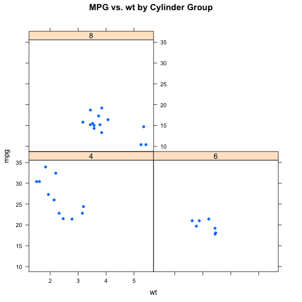

BIOS560R Spring 2014 Week 5 Lab 2: Graphics Part 2
============================================================
Pittard wsp@emory.edu
***

## Base Graphics Cont - Lattice graphics

PRACTICE 1.0) LET'S DRAW SOME BARPLOTS USING COLORS AND ALSO LOOK AT SOME "COLOR RAMPS"


```r
myt = tapply(mtcars$mpg, mtcars$cyl, mean)

# tapply produces a table

barplot(myt, main = "Mean MPG per Cylinder Group", col = heat.colors(3))
```

 

```r

myt = tapply(mtcars$mpg, mtcars$carb, mean)

barplot(myt, main = "Mean MPG per Carb group", col = terrain.colors(length(myt)), 
    legend = T)
```

 

```r

barplot(rev(sort(myt)), main = "Mean MPG per Carb group", col = terrain.colors(length(myt)), 
    legend = T)
```

 

```r

mycols = colorRampPalette(c("red", "blue"))(6)


barplot(rev(sort(myt)), main = "Mean MPG per Carb group", col = mycols, legend = T)
```

 

```r


myt = tapply(mtcars$mpg, mtcars$cyl, mean)

# tapply produces a table

barplot(rev(sort(myt)), main = "Mean MPG per Cylinder Group", col = heat.colors(3))
```

 

***

## More Annotation
PRACTICE 1.2) WE CAN ALSO ANNOTATE OUR BARPLOTS


```r
myt = tapply(mtcars$mpg, mtcars$cyl, mean)

# tapply produces a table

temp = barplot(myt, main = "Mean MPG per Cylinder Group", col = heat.colors(3))

temp  # These represent the X coordinates for each bar
```

```
##      [,1]
## [1,]  0.7
## [2,]  1.9
## [3,]  3.1
```

```r

# x y text

text(0.7, 10, 26.66)  # We put up the means one by one

text(1.9, 10, 19.74)

text(3.1, 10, 15.1)
```

 

```r

# This will put up the text in one go


temp = barplot(myt, main = "Mean MPG per Cylinder Group", col = heat.colors(3))

text(temp, 10, round(myt, 2))
```

 

***

## Boxplots

PRACTICE 1.3) HERE WE CAN DRAW THE BOXPLOT VALUES ON THE ACTUAL GRAPH


```r
fivenum(mtcars$mpg)  # RETURNS THE FIVE NUM SUMMARY
```

```
## [1] 10.40 15.35 19.20 22.80 33.90
```

```r

boxplot(mtcars$mpg, main = "MPG Boxplot", xlab = "MPG", col = "aquamarine")
```

 

```r

# LET'S PUT UP A BOXPLOT WITH TWO COLORS

boxplot(mpg ~ am, data = mtcars, main = "MPG / Transmission", col = heat.colors(2), 
    names = c("auto", "manual"))

legend(0.5, 33, c("Auto", "Manual"), fill = heat.colors(2))
```

 

```r

# THIS WILL AUTOMATICALLY GENERATE THREE BOXPLOTS - ONE FOR EACH CYLINDER
# GROUP

boxplot(mpg ~ cyl, data = mtcars, main = "MPG by Cylinders", col = rainbow(3), 
    horizontal = TRUE, names = c("Four", "Six", "Eight"))
```

 

```r

# THIS IS THE SAME AS ABOVE EXCEPT WE USE A COLOR PALETTE

boxplot(mpg ~ cyl, main = "MPG vs. Cylinder", data = mtcars, notch = TRUE, col = terrain.colors(3))
```

```
## Warning: some notches went outside hinges ('box'): maybe set notch=FALSE
```

 

```r

# THE BOXPLOT FUNCTION RETURNS INFORMATION WE CAN USE

boxplot(mtcars$mpg, main = "MPG Boxplot", xlab = "MPG", col = "aquamarine")


# WE SAVE THE PLOT INTO A VARIABLE FOR LATER INSPECTION AND USE

hold = boxplot(mtcars$mpg, main = "MPG Boxplot", xlab = "MPG", col = "aquamarine")
hold
```

```
## $stats
##       [,1]
## [1,] 10.40
## [2,] 15.35
## [3,] 19.20
## [4,] 22.80
## [5,] 33.90
## 
## $n
## [1] 32
## 
## $conf
##       [,1]
## [1,] 17.12
## [2,] 21.28
## 
## $out
## numeric(0)
## 
## $group
## numeric(0)
## 
## $names
## [1] ""
```

```r

text(1, 10.4, 10.4)
text(1, 15.35, 15.35)
text(1, 19.2, 19.2)
text(1, 22.8, 22.8)
text(1, 33.9, 33.9)


# OR could put up text in one go

text(1, hold$stats[, 1], hold$stats[, 1])
```

 

```r

tmpvar = boxplot(mpg ~ cyl, data = mtcars)


tmpvar$stats
```

```
##      [,1]  [,2] [,3]
## [1,] 21.4 17.80 13.3
## [2,] 22.8 18.65 14.3
## [3,] 26.0 19.70 15.2
## [4,] 30.4 21.00 16.4
## [5,] 33.9 21.40 19.2
```

```r

tmpvar$stats[3, ]
```

```
## [1] 26.0 19.7 15.2
```

```r

mtext(at = 1:3, text = tmpvar$stats[3, ])

# THIS IS THE SAME AS DOING THE FOLLOWING:

mtext(at = 1, text = tmpvar$stats[3, 1], side = 3)  # top margin
mtext(at = 2, text = tmpvar$stats[3, 2], side = 3)  # top margin
mtext(at = 3, text = tmpvar$stats[3, 3], side = 3)  # top margin
```

 

***

## Lattice Graphics

PRACTICE 2.0) LATTICE GRAPHICS AFFORDS US SOME CONVENIENCE THAT THE BASE GRAPHICS DOES NOT. 

```r
library(lattice)  # Required for all lattice plot commands
```

```
## Warning: package 'lattice' was built under R version 3.0.2
```

```r

# We can specify attributes of the points and the graph using arguments

xyplot(mpg ~ wt | factor(carb), data = mtcars, pch = 19, main = "MPG vs Wt per Carb #", 
    type = c("p", "g"))
```

 

```r

# Lattice graphics let's us take advantage of factors in a way that base
# graphics does not

mtcars$am = factor(mtcars$am, labels = c("auto", "manual"))

mtcars$am
```

```
##  [1] manual manual manual auto   auto   auto   auto   auto   auto   auto  
## [11] auto   auto   auto   auto   auto   auto   auto   manual manual manual
## [21] auto   auto   auto   auto   auto   manual manual manual manual manual
## [31] manual manual
## Levels: auto manual
```

```r

levels(mtcars$am)
```

```
## [1] "auto"   "manual"
```

```r

# We want to plot mpg vs wt as a function of cylinder groups. this is really
# easy

xyplot(mpg ~ wt, data = mtcars, pch = 19, main = "MPG vs. Weight")
```

 

```r

xyplot(mpg ~ wt, data = mtcars, pch = 19, main = "MPG vs. Weight", type = c("p", 
    "g"))
```

 

```r

xyplot(mpg ~ wt | factor(cyl), data = mtcars, pch = 16, main = "MPG vs. wt by Cylinder Group")
```

 

```r

xyplot(mpg ~ wt | factor(cyl), data = mtcars, pch = 16, type = c("p", "g"), 
    main = "MPG vs. wt by Cylinder Group", layout = c(1, 3))
```

 

***

PRACTICE 2.1) LATTICE GRAPHICS / xyplot CONTINUED


```r

# We can adjust the layout easily

library(lattice)

xyplot(mpg ~ wt | factor(cyl), data = mtcars, layout = c(3, 1))
```

 

```r

# the conveniences afforded by lattice graphics work with other lattice
# functions

histogram(~mpg, data = mtcars, main = "MPG for all groups")
```

 

```r

histogram(~mpg | factor(cyl), data = mtcars, layout = c(3, 1))
```

 

```r

# here we can use the auto.key argument to create a legend automatically.

xyplot(mpg ~ wt, data = mtcars, groups = factor(am), type = c("p", "g"), main = "MPG vs. Wt", 
    auto.key = TRUE)
```

 

```r

# OK


xyplot(mpg ~ wt, data = mtcars, groups = cyl, main = "MPG vs. Wt", auto.key = TRUE)
```

 

```r


# the auto.key argument supports a list structure that allows for
# customization

xyplot(mpg ~ wt, data = mtcars, groups = factor(am), main = "MPG vs. Wt", auto.key = list(title = "Transmission Type", 
    cex = 0.6, columns = 2))
```

 

```r

# The legend can grow and grow

xyplot(mpg ~ wt, data = mtcars, groups = factor(am), main = "MPG vs. Wt", pch = 19, 
    auto.key = list(title = "Transmission Type", cex = 0.6, columns = 2, space = "right"))
```

 

```r

# here we tell lattice where to put the legend explicitly

xyplot(mpg ~ wt, data = mtcars, groups = factor(am), main = "MPG vs. Wt", pch = 19, 
    type = c("p", "g"), auto.key = list(title = "Transmission Type", cex = 0.6, 
        columns = 2, corner = c(1, 1)))
```

 

```r


xyplot(mpg ~ wt | factor(cyl), data = mtcars, pch = 16, layout = c(3, 1), main = "MPG vs Wt per Cylinder", 
    type = c("p", "g"))
```

 

```r


xyplot(mpg ~ wt | factor(cyl), data = mtcars, pch = 16, layout = c(3, 1), groups = factor(am, 
    labels = c("Auto", "Manual")), type = c("p", "g"), auto.key = TRUE)
```

 

```r

xyplot(mpg ~ wt | factor(cyl), data = mtcars, main = "MPG vs Wt per cylinder Group", 
    groups = factor(am), pch = 21, type = c("p", "g"), layout = c(1, 3), auto.key = list(columns = 2))
```

 

***
